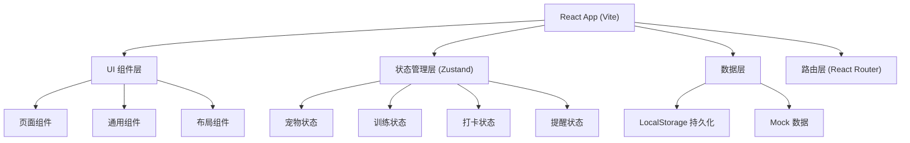
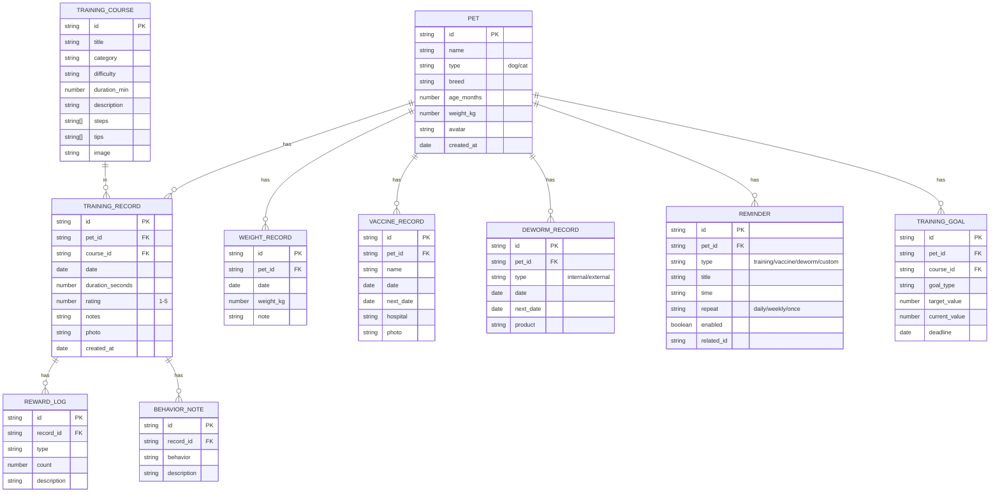

## 1. 架构设计



## 2. 技术描述

- **前端框架**: React@18 + TypeScript
- **构建工具**: Vite@5
- **样式方案**: Tailwind CSS@3
- **状态管理**: Zustand
- **路由**: React Router DOM@6
- **图标**: Lucide React
- **图表**: Recharts
- **动画**: Framer Motion
- **日期处理**: date-fns
- **数据持久化**: localStorage
- **UI组件**: 自定义组件（基于Tailwind CSS）

## 3. 路由定义

| 路由 | 页面 | 说明 |
|------|------|------|
| / | 首页计划 | 今日训练概览、快捷入口、本周统计 |
| /courses | 训练课程 | 课程列表、分类筛选 |
| /courses/:id | 课程详情 | 分步动作说明、开始训练入口 |
| /training/:id | 训练界面 | 计时器、奖励记录、完成打卡 |
| /records | 打卡记录 | 日历视图、打卡列表 |
| /records/:id | 打卡详情 | 详细记录、照片对比 |
| /pets | 宠物档案 | 宠物列表、切换宠物 |
| /pets/:id | 宠物详情 | 基本信息、体重曲线、疫苗驱虫 |
| /pets/add | 添加宠物 | 创建新宠物档案 |
| /reminders | 提醒中心 | 提醒列表、设置 |
| /weekly-review | 每周复盘 | 数据总结、评分、建议 |

## 4. 数据模型

### 4.1 数据模型定义



### 4.2 数据结构

```typescript
// Pet
interface Pet {
  id: string;
  name: string;
  type: 'dog' | 'cat';
  breed: string;
  ageMonths: number;
  weightKg: number;
  avatar: string;
  createdAt: string;
}

// Training Course
interface TrainingCourse {
  id: string;
  title: string;
  category: string;
  difficulty: 'easy' | 'medium' | 'hard';
  durationMin: number;
  description: string;
  steps: string[];
  tips: string[];
  image: string;
}

// Training Record
interface TrainingRecord {
  id: string;
  petId: string;
  courseId: string;
  date: string;
  durationSeconds: number;
  rating: number;
  notes: string;
  photo?: string;
  rewards: RewardLog[];
  behaviorNotes: BehaviorNote[];
  createdAt: string;
}

// Weight Record
interface WeightRecord {
  id: string;
  petId: string;
  date: string;
  weightKg: number;
  note?: string;
}

// Vaccine Record
interface VaccineRecord {
  id: string;
  petId: string;
  name: string;
  date: string;
  nextDate?: string;
  hospital?: string;
  photo?: string;
}

// Deworm Record
interface DewormRecord {
  id: string;
  petId: string;
  type: 'internal' | 'external';
  date: string;
  nextDate?: string;
  product?: string;
}

// Reminder
interface Reminder {
  id: string;
  petId: string;
  type: 'training' | 'vaccine' | 'deworm' | 'custom';
  title: string;
  time: string;
  repeat: 'daily' | 'weekly' | 'once';
  enabled: boolean;
  relatedId?: string;
}
```

## 5. 组件架构

### 5.1 通用组件
- `Button` - 按钮组件（主按钮、次按钮、胶囊按钮）
- `Card` - 卡片组件
- `Icon` - 图标组件
- `ProgressBar` - 进度条
- `Rating` - 评分组件（星星）
- `TabBar` - 底部导航栏
- `Header` - 顶部导航栏
- `Modal` - 弹窗组件
- `Input` - 输入框组件
- `DatePicker` - 日期选择器

### 5.2 业务组件
- `PetCard` - 宠物卡片
- `CourseCard` - 课程卡片
- `TrainingTimer` - 训练计时器
- `Calendar` - 打卡日历
- `WeightChart` - 体重曲线图
- `RecordItem` - 打卡记录项
- `ReminderItem` - 提醒项
- `WeeklyScore` - 每周评分

### 5.3 页面组件
- `HomePage` - 首页
- `CoursesPage` - 课程列表页
- `CourseDetailPage` - 课程详情页
- `TrainingPage` - 训练计时页
- `RecordsPage` - 打卡记录页
- `RecordDetailPage` - 打卡详情页
- `PetsPage` - 宠物档案页
- `PetDetailPage` - 宠物详情页
- `AddPetPage` - 添加宠物页
- `RemindersPage` - 提醒中心页
- `WeeklyReviewPage` - 每周复盘页

## 6. 状态管理

使用 Zustand 管理全局状态：

- `usePetStore` - 宠物相关状态（当前宠物、宠物列表、增删改查）
- `useTrainingStore` - 训练相关状态（课程列表、训练中状态、记录列表）
- `useReminderStore` - 提醒相关状态（提醒列表、开关控制）
- `useUIStore` - UI状态（加载状态、弹窗状态等）

## 7. 性能优化

- 组件懒加载（React.lazy + Suspense）
- 列表虚拟滚动（长列表）
- 状态按需订阅
- 图片懒加载
- 防抖节流处理
- localStorage 数据缓存
